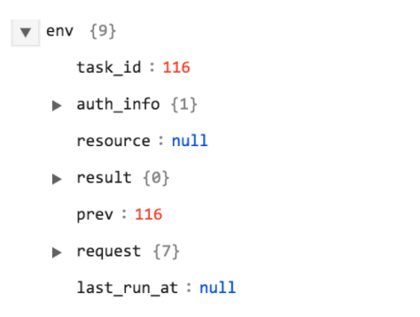
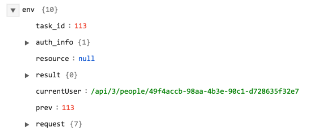
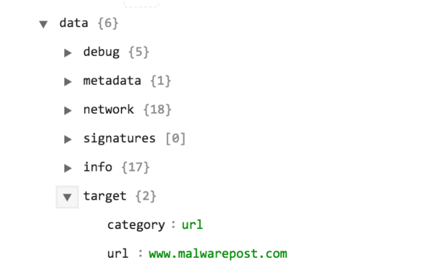
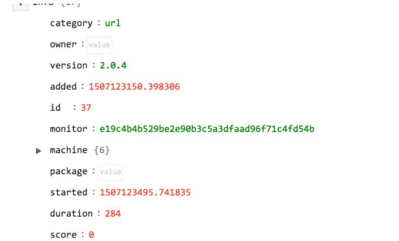

## About the connector

The Cuckoo Malware sandbox provides a service that analyzes suspicious file samples and URLs, and gets the reputation of submitted entities. 

This document provides information about the Cuckoo connector, which facilitates automated interactions, with a Cuckoo server using CyOPs™ playbooks. Add the Cuckoo connector as a step in CyOPs™ playbooks and perform automated operations, such as scanning and analyzing suspicious files and URLs and retrieving reports from Cuckoo for files and URLs that you have submitted to Cuckoo.

### Version information

Connector Version: 1.0.0

Compatibility with CyOPs™ Versions: 4.9.0.0-708 and later

Compatibility with Cuckoo Sandbox Versions: 2.0.4 and later

## Installing the connector

All connectors provided by  CyOPs™ are delivered using a CyOPs™ repository. Therefore, you must set up your CyOPs™ repository and use the `yum` command to install connectors:

`yum install cyops-connector-cuckoo`

To update a  CyOPs™-provided connector use the following command:

`yum update cyops-connector-cuckoo`

To remove a  CyOPs™-provided connector use the following command:

`yum remove cyops-connector-cuckoo`

The process to write your own custom connector is defined in the `Building a custom connector` topic.

## Prerequisites to configuring the connector

- You must have the IP of the Cuckoo sandbox to which you will connect and perform the automated operations and credentials to access that server. 
- You must open the port on which the Cuckoo API sandbox is configured to allow communication between CyOPs™ and the Cuckoo sandbox.

## Configuring the connector

1. In CyOPs™, on the left pane, click **Connectors**.  
   On the `Connectors` page, you will see the `Cuckoo` connector.
2. Click **Configure** to configure the connector parameters.  
   The configuration parameters that you must provide are the IP of the Cuckoo sandbox server and port number to access the server API of the Cuckoo sandbox.  
   For more information, see the [Configuration parameters](#Configuration-parameters) section.  
   **Note**: You can add multiple configurations if you have more than one Cuckoo server instances in your environment. You must, therefore, specify a unique `Name` to identify each configuration in your environment.  
   If you have previous versions of a connector and you are configuring a newer version of that connector, with the same configuration parameters, then CyOPs™ fetches the configuration and input parameters of the latest available version of that connector. For example, If you have 1.0.0, 1.1.0, and 1.2.0 versions of the Cuckoo connector and you are configuring the 1.3.0 version of the Cuckoo connector, then while configuring the 1.3.0 version,  CyOPs™ will fetch the configuration and input parameters from the 1.2.0 version of the Cuckoo connector. You can review the configuration and input parameters, and then decide to change them or leave them unchanged. 
3. Click **Next**.
4. Choose the actions that you want to enable or disable using the slider in the Status column, **Enabled** or **Disabled**, based on the automated operations you want the Cuckoo connector to perform.
5. Click **Update**.  
   Once you click **Update**, the Cuckoo connector performs a health check, to check the following:  
   Connectivity to the Cuckoo sandbox server.  
   Validity of the credentials and user key provided.  
   If all the details are correct and the Cuckoo server is available then on the `Connectors` page, **Available** is displayed in the `Cuckoo Connector: Configuration Step 1 of 2` dialog.  
   If any or all the details are incorrect or the Cuckoo server is unavailable then on the `Connectors` page, **Disconnected** is displayed in the `Cuckoo Connector: Configuration Step 2 of 2` dialog.     
   You can also click the **Refresh** icon to perform a health check at any time.  

You can view the playbooks bundled with the connector. Refer to the [Included Playbooks](#Included-playbooks) section for details on the bundled playbooks. You can see the bundled playbooks in the **Orchestration and Playbooks** section in  CyOPs™ after importing the Cuckoo connector.

### Configuration parameters

In CyOPs™, on the Connectors page, select the **Cuckoo** connector and click **Configure** to configure the following parameters:

| Parameter   | Description                              |
| ----------- | ---------------------------------------- |
| Server IP   | IP of the Cuckoo sandbox server to which you will connect and perform the automated operations. |
| Port Number | Port number of the server on which the API of the Cuckoo sandbox is running. |

**Note**: You can store the keys and other confidential data using the `Secrets` store provided in CyOPs™. When you store data in the `Secrets` store, users cannot see that data. However, they can use this data when required. For more information about the `Secrets` store, see *Configuring the Secrets store* in the "Administration" guide.

## Actions supported by the connector

The following automated operations can be included in playbooks:

- Submit File: Submits a file to the Cuckoo sandbox server for analysis.
- Submit URL: Submits a URL to the Cuckoo sandbox server for analysis.
- Get Report: Retrieves a report from the Cuckoo server for the files or URLs that you had submitted to the Cuckoo server for analysis. Reports are retrieved based on the task_id of the sample. Based on the report you can determine the reputation of the submitted files or URLs.

### operation: Submit File

#### Input parameters

**Note**: Using this operation, you submit files that are available in the CyOPs™ `Attachments` module to the Cuckoo sandbox server. 

The Cuckoo sandbox server supports the uploading of the following file types to the Cuckoo sandbox for analysis:

- Doc
- Exe
- JS
- PDF
- PPT
- PS1
- RAR
- VBS
- XLS
- Zip

| Parameter        | Description                              |
| ---------------- | ---------------------------------------- |
| File to Detonate | Use the CyOPs™ File IRI to submit files directly from the CyOPs™  `Attachments` module to the Cuckoo sandbox server.  In the playbook, this defaults to the `{{vars.file_iri}}` value. |

#### Output

The JSON output contains the task_id of the submitted file. You can use this task_id in subsequent queries to retrieve scan reports from the Cuckoo server for the submitted file.

Following image displays a sample output:

### operation: Submit URL

#### Input parameters

| Parameter       | Description                              |
| --------------- | ---------------------------------------- |
| URL to Detonate | URL that you want to submit to the Cuckoo sandbox for scanning and analyzing. |

#### Output

The JSON output contains the task_id of the submitted URL. You can use this task_id in subsequent queries to retrieve scan reports from the Cuckoo server for the submitted URL.

Following image displays a sample output:

### operation: Get Report

#### Input parameters

| Parameter | Description                              |
| --------- | ---------------------------------------- |
| TaskID    | TaskID for a previously submitted file or URL for which you want to retrieve an analysis report from the Cuckoo server. |

#### Output

The JSON output contains the report retrieved from the Cuckoo sandbox server for the previously submitted files or URLs. You can use the report details to determine the reputation of the previously submitted files or URLs, along with other parameters such as, network pcap, signatures, and targets.

Following image displays a sample output:

Following image displays a sample of the score and categories of the submitted files or URLs:

## Included playbooks

The following playbooks comes bundled with the Cuckoo connector. This playbook contains steps using which you can perform all supported actions. You can see the bundled playbooks in the **Orchestration and Playbooks** section in  CyOPs™ after importing the Cuckoo connector.

- Submit File to Cuckoo
- Submit URL to Cuckoo
- Get Report for Submitted Sample

